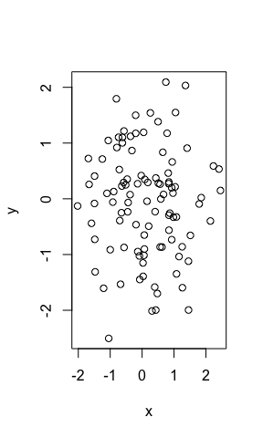

# Markdown Testing
Me  
2017-09-14  

## This is my header
This is a line of text.

- bullet 1
- bullet 2

```r
x <- rnorm(100)
y <- rnorm(100)
plot(x,y)
```

<!-- -->

```r
summary(x)
```

```
##     Min.  1st Qu.   Median     Mean  3rd Qu.     Max. 
## -2.02200 -0.61690  0.07845  0.13640  0.84160  2.45600
```


